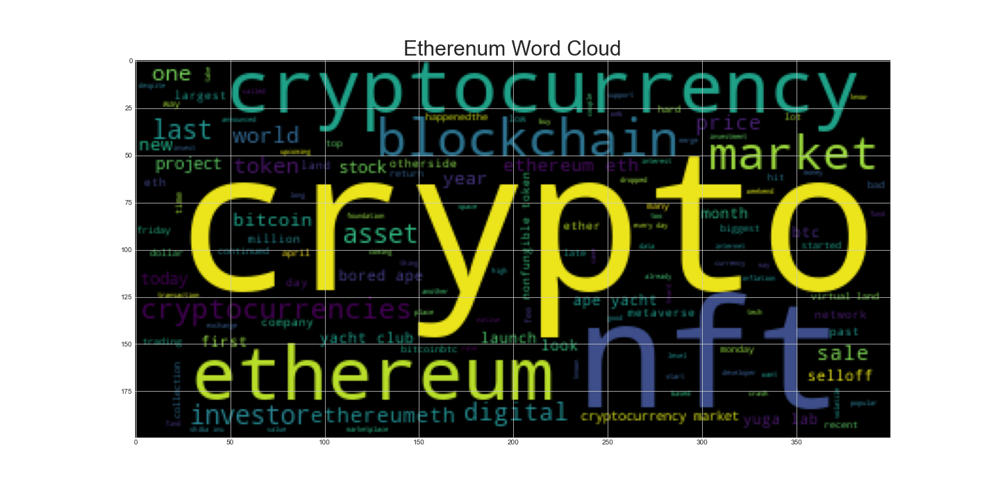

# Unit 12—Tales from the Crypto

## Background

There's been a lot of hype in the news lately about cryptocurrency, so I decided to take stock, so to speak, of the latest news headlines regarding Bitcoin and Ethereum to get a better feel for the current public sentiment around each coin.

In this assignment, I will apply natural language processing to understand the sentiment in the latest news articles featuring Bitcoin and Ethereum. I will also apply fundamental NLP techniques to better understand the other factors involved with the coin prices such as common words and phrases and organizations and entities mentioned in the articles.

Complete the following tasks:

1. [Sentiment Analysis](#1---Sentiment-Analysis)
2. [Natural Language Processing](#2---Natural-Language-Processing)
3. [Named Entity Recognition](#3---Named-Entity-Recognition)

---

### 1 - Sentiment Analysis

The [newsapi](https://newsapi.org/) is used here to pull the latest news articles for Bitcoin and Ethereum and create a DataFrame of sentiment scores for each coin.

The descriptive statistics to answer the following questions:

1. Which coin had the highest mean positive score?
    - **Based on the analysis, Ethereum has the highest Mean Positive score of 0.077630**  

2. Which coin had the highest negative score?
   - **Based on the analysis, Ethereum has the highest compound score of 0.893400**  

3. Which coin had the highest positive score?
   - **Based on the analysis, Ethereum has the highest positive score of 0.33200**  

 

### 2 - Natural Language Processing

In this section, I utilized NLTK and Python libraries to tokenize text, find n-gram counts, and create word clouds for both coins. 

#### Tokenize

During the tokenization process, I have prep the data as follows:

1. Lowercase each word.
2. Remove punctuation.
3. Remove stop words.

#### N-grams

1. Use NLTK to produce the ngrams for N = 2.
    * **The sample bigrams value for Bitcoin:** 
    {('btc', 'fell'): 1, ('fell', 'lowest'): 1, ('lowest', 'level'): 1, ('level', 'since'): 1, ('since', 'last'): 1, ('last', 'july'): 1,
         ('july', 'price'): 1, ('price', 'dropped'): 1, ('dropped', 'start'): 1, ('start', 'selloff'): 1,  ('selloff', 'cryptocurrency'): 1,
         ('cryptocurrency', 'started'): 1, ('started', 'last'): 1, ('last', 'following'): 1, ('following', 'fed'): 1, ('fed', 'decision'): 1,
         ('decision', 'hike'): 1, ('hike', 'interest'): 1, ('interest', 'rate'): 1})

    * **The sample bigrams value for Etherenum:** 
    {('multibillion', 'dollar'): 1, ('dollar', 'cryptocurrency'): 1, ('cryptocurrency', 'company'): 1, ('company', 'apologised'): 1, ('apologised', 'user'): 1,
         ('user', 'sale'): 1, ('sale', 'metaverse'): 1, ('metaverse', 'land'): 1,  ('land', 'sparked'): 1, ('sparked', 'frenzy'): 1, ('frenzy', 'temporarily'): 1,
         ('temporarily', 'brought'): 1, ('brought', 'ethereum'): 1, ('ethereum', 'cryptocurrencyyuga'): 1, ('cryptocurrencyyuga', 'lab'): 1, ('lab', 'comp'): 1})
  

2. List the top 10 words for each coin.
    * **Top 10 words for Bitcoin:**  
    [('bitcoin', 49), ('cryptocurrency', 33), ('btc', 30), ('market', 25), ('price', 22), ('cryptocurrencies', 19), ('crypto', 18),
     ('asset', 15), ('investor', 13), ('world', 13)] 

    * **Top 10 words for Etherenum:**  
    [('cryptocurrency', 25), ('ethereum', 25), ('crypto', 21), ('market', 21), ('cryptocurrencies', 18), ('eth', 15), ('token', 14),
     ('investor', 13), ('asset', 13), ('nft', 12)]

#### Word Clouds

The following word clouds have been generated to summarize the news for each coin.

### 3 - Named Entity Recognition

In this section, I have built a named entity recognition model for both coins and visualized the tags using SpaCy.

[Bitcoin_NER](https://nithy29.github.io/Tales_from_the_Crypto/Images/Bitcoin_NER.html)

[Ethereum_NER.html](https://nithy29.github.io/Tales_from_the_Crypto/Images/Ethereum_NER.html)

